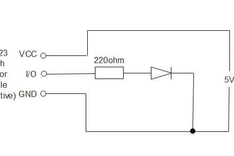
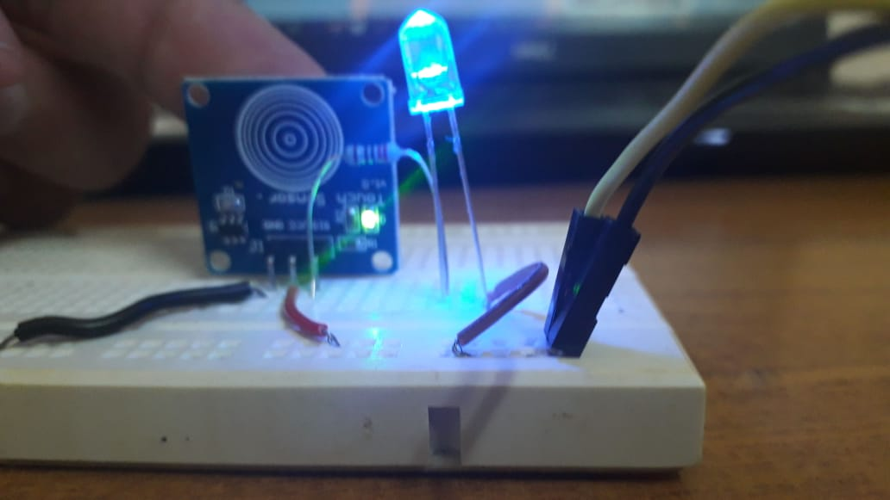

# NEarphones

Smart Tangle Free Earphones

## Technical Aspects

### Components Required

1. Arduino Nano  -  Rs. 250
2. Bluetooth module (HC-05 preferably, if not then HC-06)  -  Rs. 250
3. 220ohm resistors x 5  -  Rs. 10
4. LEDs - 2 blue, 2 red  -  Rs. 10
5. Jumpers: 7M-M, 5M-F, 3F-F - Rs. 30 (around)
6. TTP223 Touch Key Module  - Rs. 70

**Total Cost = Rs. 620**

## Phases

This project has been done in 3 phases, 

1. Creating a touch sensor
2. Connecting touch sensor to device using bluetooth
3. The Application

### Phase 1

